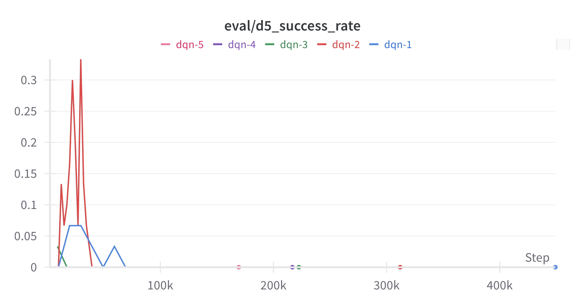
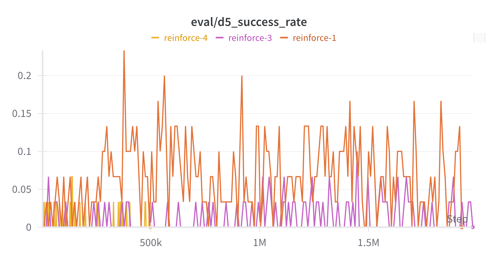
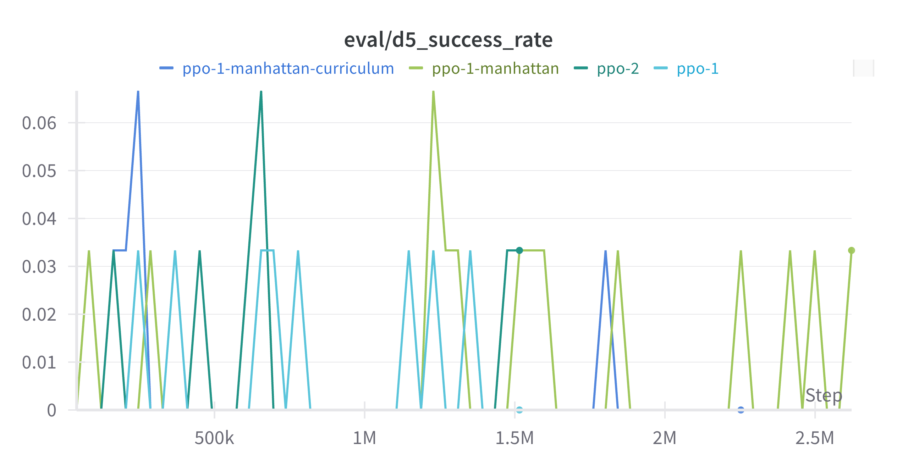
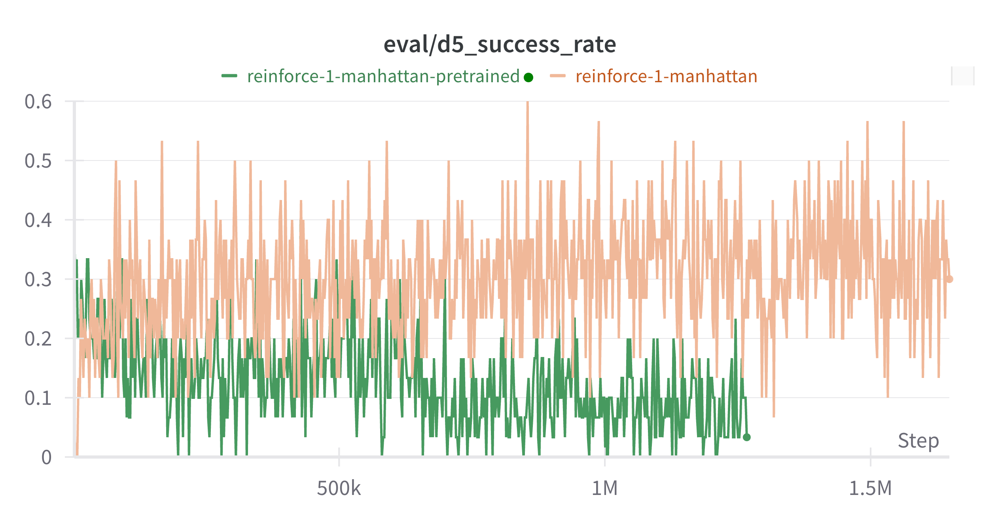
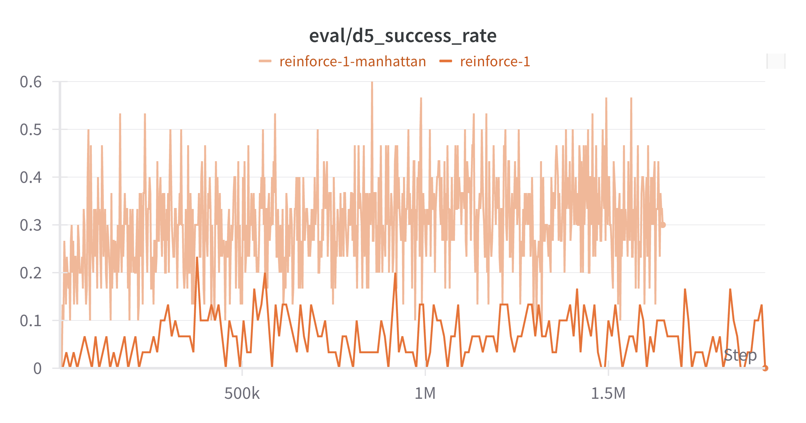
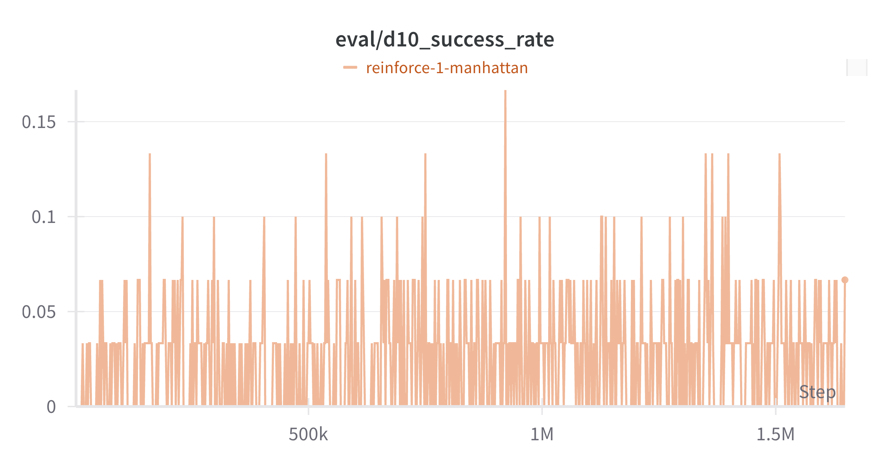

# RubiksRL: Experimental Report

This document summarizes what was done in the RubiksRL project, which approaches worked, which didn’t, and key observations about generalization. The goal was to train agents to solve Rubik’s Cube scrambles at multiple step horizons (5/10/15/20), evaluating success and sample-efficiency under different algorithms, reward designs, model capacities, pretraining, and curriculum learning.

## 1. Overview of Experiments

We executed a series of runs across REINFORCE (vanilla policy gradient), PPO, and DQN baselines with multiple configurations:
- Algorithms: REINFORCE, PPO, DQN
- Rewards: Unshaped (sparse), step-penalty variants, Manhattan-distance-based reward shaping
- Additional techniques: Supervised pretraining, curriculum learning (increasing target distances)
- Model capacity: From 2-layer MLPs to deeper/wider networks (e.g., [512,512] up to [1024,1024,1024,1024])
- Evaluation horizons: [5, 10, 15, 20] step scrambles
- Hardware: CUDA-enabled runs
- Tracking: Weights & Biases (wandb) logging with per-distance evaluation metrics

A non-exhaustive list of run identifiers (see all_runs.csv for full details):
- REINFORCE baselines: reinforce-1, reinforce-2, reinforce-3, reinforce-4
- REINFORCE + Manhattan reward: reinforce-1-manhattan, reinforce-2-manhattan
- REINFORCE + Manhattan + Curriculum: reinforce-1-manhattan-curriculum
- REINFORCE + Manhattan + Pretraining: reinforce-1-manhattan-pretrained, reinforce-1-manhattan-pretrained-large
- PPO baselines and PPO + Manhattan: ppo-1, ppo-2, ppo-1-manhattan, ppo-1-manhattan-curriculum
- DQN baselines and DQN + Manhattan: dqn-1, dqn-2, dqn-3, dqn-4, dqn-5, dqn-1-manhattan

Note: Some runs are still “running” or “crashed”; this section lists the experimental coverage only, without inferring results from their final metrics.

## 2. Experimental Setup

- Environment: Rubik’s Cube environment with scramble distances 5/10/15/20.
- Training and evaluation:
  - Periodic evaluation at each distance: average return, success rate, solved episode counts, steps-to-solve when solved.
  - Episode and update-based logging (e.g., episode/return, eval/dX_success_rate, progress/update).
- Hyperparameters:
  - REINFORCE: Typical settings include gamma ≈ 0.995–0.999, hidden sizes around 512, lr in [1e-4, 3e-4], layernorm used in many configs, siLU activations tried.
  - PPO: Clipping coef ≈ 0.2, gae_lambda ≈ 0.95, multiple epochs per update, minibatch sizes ≈ 256, entropy/value losses tuned.
  - DQN: Replay buffer sizes up to 200k, epsilon schedules, target update steps, and learning rates from 1e-4 to 1e-3.
- Reward variants:
  - Sparse reward (goal-only) and step-penalty variants.
  - Manhattan-distance-based shaped reward (potential-based form).
- Techniques:
  - Supervised pretraining from expert or heuristic policies.
  - Curriculum learning increasing max scramble distance.

## 3. What Didn’t Work

1) Simple algorithms without shaped rewards

- DQN, REINFORCE, PPO using only sparse reward had great difficulty converging to successful policies across distances. Exploration and credit assignment were insufficient.

*Evaluation of success in d=5 for DQN*

*Evaluation of success in d=5 for REINFORCE*

2) Adding a hacked step penalty as “reward shaping”
- Introducing a step penalty (non-potential-based) did not yield better convergence, aligning with policy invariance results for potential-based shaping: Ng, Harada, Russell (1999), “Policy Invariance Under Reward Transformations: Theory and Application to Reward Shaping.”

3) PPO stability and convergence

- PPO proved difficult to stabilize and converge to useful policies in this domain under tested configurations. Tuning helped marginally but did not consistently reach strong performance.

*Evaluation of success in d=5 for PPO*

4) Increasing model size
- Scaling MLP width/depth alone did not significantly improve performance. Capacity without aligned signal (exploration, credit assignment, shaped rewards) didn’t translate into higher success.

5) Supervised pretraining
- Pretraining provided an initial performance boost but ultimately converged to worse final outcomes than non-pretrained counterparts, regardless of pretraining size. Likely due to suboptimal inductive bias or overfitting to supervised targets that misalign with long-horizon credit assignment during RL fine-tuning.

*Comparison of pretrained MLP (green) vs non-retrained (beige)*

6) Curriculum learning
- Curriculum attempts struggled to maintain convergence when increasing maximum distance; agents often plateaued or failed to transfer improvements across distance increments.

## 4. What Worked

1) REINFORCE with shaped reward
- Among all tested configurations, REINFORCE worked best overall when paired with the right reward signal and straightforward optimization.

*Comparison of basic reward REINFORCE (orange) and shaped reward REINFORCE (beige)*

2) Manhattan-distance-based reward shaping
- Using a simple potential-based shaping signal derived from Manhattan distance improved training stability and results, while preserving optimal policy invariance guarantees (cf. Ng et al., 1999). This guided exploration and credit assignment without distorting the underlying optimal solution.

## 5. Generalization and Extrapolation

- We did not observe strong extrapolation from 5-step training to 10/15/20 steps without explicit exposure.
- The best results were achieved with REINFORCE + Manhattan reward without pretraining, reaching up to ≈16% evaluation success at 10 steps.

*Results for REINFORCE + Manhattan (best model) on d=10*

- There is no emergent ability to solve significantly longer scrambles purely from shorter-horizon training in the current setup; explicit training at the target distances remains necessary.

## 6. Limitations

- Compute and wall-clock constraints limited extensive PPO/DQN hyperparameter sweeps and algorithmic variants (e.g., more sophisticated exploration, distributional RL, or auxiliary tasks).
- Sparse reward nature of Rubik’s Cube exacerbates exploration challenges; potential-based shaping helps but may still be insufficient for long horizons without additional innovations.
- The environment details (scramble distributions, evaluator thresholds) strongly affect learnability; minor changes can significantly alter training dynamics.

## 7. Future Work

- Explore stronger exploration strategies: intrinsic motivation, count-based bonuses on cube states, or novelty search tailored to cube group structure.
- Leverage potential-based shaping grounded in cube theory (e.g., admissible heuristics beyond Manhattan proxies).
- Try off-policy actor-critic with careful target networks and distributional critics; investigate SF-based or successor features approaches for transfer across distances.
- Systematic PPO stability study: adaptive KL penalties, value clipping schedules, advantage normalization strategies, and better initialization.
- Revisit pretraining with behavior cloning on higher-quality data and early-stopping to preserve plasticity; consider offline RL pretraining.
- Curriculum redesign: overlap windows, regressively mixed batches (replay of easier distances), or reverse curriculum from near-solved states with annealed difficulty.

## 8. References

- Ng, A. Y., Harada, D., & Russell, S. (1999). Policy Invariance Under Reward Transformations: Theory and Application to Reward Shaping. ICML.
- Capacity vs. performance intuition: Larger capacity does not guarantee better RL outcomes without improved signal or optimization. See e.g., discussions in deep RL stability literature; this observation in our setting is empirical and domain-specific.

## Appendix A: Aggregate of Runs (from all_runs.csv)

This section lists what we ran, without drawing conclusions from their results.

- REINFORCE family:
  - Baselines: reinforce-1, reinforce-2, reinforce-3, reinforce-4
  - Manhattan reward: reinforce-1-manhattan, reinforce-2-manhattan
  - Manhattan + Curriculum: reinforce-1-manhattan-curriculum
  - Manhattan + Pretraining: reinforce-1-manhattan-pretrained, reinforce-1-manhattan-pretrained-large
- PPO family:
  - Baselines: ppo-1, ppo-2
  - Manhattan: ppo-1-manhattan
  - Manhattan + Curriculum: ppo-1-manhattan-curriculum
- DQN family:
  - Baselines: dqn-1, dqn-2, dqn-3, dqn-4, dqn-5
  - Manhattan: dqn-1-manhattan

Evaluate horizons included [5, 10, 15, 20], with logging of per-distance success rates, returns, and steps-when-solved.